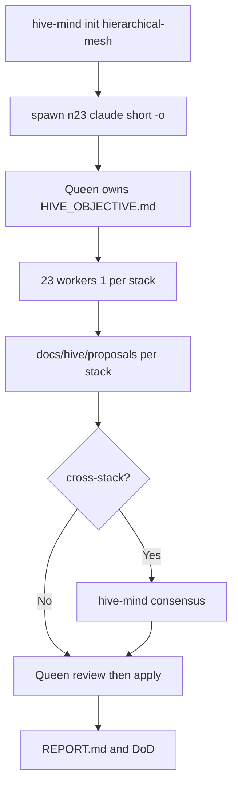

# Hive objective — Dockge stacks (Synology)

Canonical brief for `claude-flow hive-mind` workers and queen. **Spawn with a short `-o` that points here**; operational detail lives in this file, not in the CLI string.

## One-line mission

Raise **all 23** Dockge stack folders under this repo to **production-grade reliability, observability, and maintainability** on Synology without changing service intent, and produce a **deployable HAProxy front-door spec** (stretch) using existing ACME material under `/volume1/certs/acme/`.

## Context (authoritative)

| Item                                       | Value                                                                                                                                                                                                                                                                                                                                            |
| ------------------------------------------ | ------------------------------------------------------------------------------------------------------------------------------------------------------------------------------------------------------------------------------------------------------------------------------------------------------------------------------------------------ |
| Repo root (git)                            | `/Volumes/docker/dockge` (or `/volume1/docker/dockge` on NAS)                                                                                                                                                                                                                                                                                    |
| Stack root (Dockge `DOCKGE_STACKS_DIR`)    | `/Volumes/docker/dockge/stacks` (or `/volume1/docker/dockge/stacks` on NAS)                                                                                                                                                                                                                                                                      |
| Stack folders (Dockge `DOCKGE_STACKS_DIR`) | **23** — `acme-sh`, `agents_gateway_data`, `code-server`, `codex-docs`, `databases`, `docker-model-runner`, `dozzle`, `github-desktop`, `grafana-prom`, `holyclaude`, `homepage`, `it-tools`, `mcp-tools-config`, `ollama`, `openresume`, `portainer`, `rag-stack`, `searxng`, `traefik-mft`, `traefik-ots`, `warp-main`, `watchtower`, `zabbix` |
| Workers (hive inventory)                   | **21** — **one worker per stack folder** (same names as rows above)                                                                                                                                                                                                                                                                              |
| Dev / high-privilege note                  | `holyclaude` — validate separately; extra caps (`SYS_ADMIN`, `seccomp:unconfined`) documented in that stack’s proposal                                                                                                                                                                                                                           |
| Host                                       | Synology NAS, LAN `10.0.1.15`, `TZ=America/New_York`                                                                                                                                                                                                                                                                                             |
| Primary domain                             | **`otsorundscore.olutechsys.com`** (and related zones per [stacks/acme-sh/AGENTS.md](stacks/acme-sh/AGENTS.md)); stack configs and HAProxy use **`otsorundscore`** hostnames only                                                                                                                                                                |
| TLS                                        | `acme-sh` issues to `/volume1/certs/acme/` — **do not edit cert/key files**; reference paths only in proposals                                                                                                                                                                                                                                   |

## Short `-o` for spawn (keep under ~200 characters)

Use this verbatim (or a trivial variant); full rules are in this file:

```text
Read HIVE_OBJECTIVE.md. 23 workers: 1 per stack folder. Proposals only in docs/hive/proposals/. Queen consensus before cross-stack or compose apply. Stretch: _haproxy/haproxy.cfg.
```

## Pre-flight (before `spawn`)

```bash
cd /Volumes/docker/dockge   # or NAS: cd /volume1/docker/dockge
claude-flow hive-mind init -t hierarchical-mesh
claude-flow hive-mind spawn --count 23 --claude -o 'Read HIVE_OBJECTIVE.md. 23 workers: 1 per stack folder. Proposals only in docs/hive/proposals/. Queen consensus before cross-stack or compose apply. Stretch: _haproxy/haproxy.cfg.'
```

Use `--count <N>`, **not** `-n <N>`. In ruflo v3.6.10 the `-n` / `--workers` flags are silently ignored and always spawn 1 worker, despite appearing in `--help` examples.

Do **not** pipe `head -1` from this file into `-o` — the first line is not sufficient context.

---

## Milestones and success criteria

| Phase                      | Goal               | Done when                                                                                                                                                                                                                                                                                                                                                                                           |
| -------------------------- | ------------------ | --------------------------------------------------------------------------------------------------------------------------------------------------------------------------------------------------------------------------------------------------------------------------------------------------------------------------------------------------------------------------------------------------- |
| **M0 — Bootstrap**         | Hive + repo layout | `hive-mind init` complete; [docs/hive/README.md](docs/hive/README.md) exists; every worker has read this file                                                                                                                                                                                                                                                                                       |
| **M1 — Inventory**         | Truth on disk      | Each stack has `docs/hive/proposals/<stack>/INVENTORY.md` (services, images/tags/digests, ports, volumes, networks, secrets **surface only**, gaps vs baseline); confirm no stale **`orundscore`** hostname (`rg '(?<!ots)orundscore'` per [stacks/acme-sh/AGENTS.md](stacks/acme-sh/AGENTS.md))                                                                                                    |
| **M2 — Baseline parity**   | Non-negotiables    | Every `compose.yaml` matches the baseline block **or** carries a documented exception in that stack’s proposal                                                                                                                                                                                                                                                                                      |
| **M3 — Operability**       | Health, logs, env  | Healthchecks where technically possible; `logging` (e.g. `json-file` with `max-size` / `max-file`) for Dozzle-friendly logs; `.env.example` per stack; **no edits to gitignored `.env`** (secrets stay local)                                                                                                                                                                                       |
| **M4 — Cross-cutting**     | Platform           | Dozzle sees intended containers; Homepage widget **spec** per stack (as proposal); monitoring/backup **proposals** merged only after consensus (see scope below)                                                                                                                                                                                                                                    |
| **M5 — HAProxy (stretch)** | Edge               | `docs/hive/proposals/_haproxy/haproxy.cfg` + install/rollback note; TLS from `/volume1/certs/acme/` (cite **exact** PEM paths used); `option forwardfor if-none` per [HAProxy 2.4](https://cbonte.github.io/haproxy-dconv/2.4/configuration.html#option%20forwardfor); `http-request set-header X-Forwarded-Proto https`; sane `timeout` block; backends to `10.0.1.15:<port>` where stacks publish |
| **M6 — Closeout**          | Sign-off           | [docs/hive/REPORT.md](docs/hive/REPORT.md) lists per-stack outcomes, risks, rollback; DoD below satisfied                                                                                                                                                                                                                                                                                           |

---

## Conventions

### Restart policy

- **Default:** `restart: unless-stopped` for long-running services.
- **Adopted:** 2026-05-01 — replaces `restart: on-failure:5` and `restart: always` repo-wide.
- **Exception:** one-shot or init containers may use `restart: "no"` with an `# intentional` inline comment in `compose.yaml`.

## Baselines (non-negotiable unless documented exception)

Apply to every service where Compose and the image allow it:

- `security_opt: [no-new-privileges:true]`
- `restart: unless-stopped`
- `com.centurylinklabs.watchtower.enable=true` label when Watchtower is in use
- `mem_limit` and `cpu_shares` with a **one-line rationale** in the stack proposal
- `TZ=America/New_York` where environment is used
- `PUID` / `PGID` (or `SYNO_UID` / `SYNO_GID` where applicable) default to **root (`0`/`0`)** on the NAS; override in `.env` for local dev only

**Image pinning policy (pick one per service, document in proposal):**

- **Preferred:** pin by **digest**; Watchtower may still notify; upgrades are deliberate, or
- **Alternate:** explicit **semver tag** (not bare `:latest`) with rationale if digest pinning breaks the image.

Do **not** bump major image versions or change registries without explicit queen approval.

## Guardrails

- **No silent mutations:** workers write under `docs/hive/proposals/<stack>/` (patch + rationale + rollback). Applying edits to tracked `compose.yaml` / config in-repo is **after** queen (or consensus) review—prefer small PR-sized proposals.
- **Forbidden without explicit approval:** major image bumps; removing `network_mode: host` where present; modifying contents under `/volume1/certs/acme/`; committing real secrets (`CF_Token`, passwords, webhooks, etc.). Only **`.env.example`** documents keys; never commit populated `.env`.
- **Compose compatibility (Synology):** tracked stacks use **`depends_on` without `condition:`** so Package Center `docker compose` versions stay compatible. Use healthchecks + `restart` policies for resilience instead of Compose v2 condition forms.
- **Host networking (`acme-sh`):** healthchecks and logging may differ; use **documented** exceptions instead of forcing impossible patterns.

## RACI — cross-cutting (avoid parallel workers colliding)

| Track                                    | Responsible                                                  | Accountable | Consulted                                                                           |
| ---------------------------------------- | ------------------------------------------------------------ | ----------- | ----------------------------------------------------------------------------------- |
| Dozzle / log visibility                  | Worker **`dozzle`**                                          | Queen       | All stacks                                                                          |
| Homepage widgets / allowed hosts         | Worker **`homepage`**                                        | Queen       | Stacks with public URLs                                                             |
| Monitoring (Prometheus/Grafana)          | **Queen only** (draft in `docs/hive/proposals/_monitoring/`) | Queen       | All — **proposal only; no new compose stack merged without explicit user approval** |
| Backups / stateful volumes               | **Queen only** (`docs/hive/proposals/_backups/`)             | Queen       | Stacks with volumes                                                                 |
| Root `AGENTS.md` + repo-wide conventions | **Queen**                                                    | Queen       | All workers                                                                         |
| HAProxy stretch                          | **Queen** (`docs/hive/proposals/_haproxy/`)                  | Queen       | `acme-sh`, `homepage`                                                               |

Per-stack workers still file findings in their own `proposals/<stack>/` and link to cross-cutting drafts.

## Per-stack acceptance (each worker before “done”)

- Image: digest **or** explicit semver tag; no unjustified `:latest`
- `healthcheck` with realistic `test`, `interval`, `timeout`, `retries`, `start_period` (or documented impossibility)
- Baseline block + documented resource limits
- Volumes: `${STACK_ROOT}/<stack>/...` (absolute after `init-nas.sh`); `:ro` where the container does not need write
- `.env.example` for all non-secret tunables; secrets remain gitignored
- `logging` driver/options suitable for Dozzle
- `README.md` in stack folder: purpose, ports, env vars, dependencies, health meaning, rollback

## Consensus

- **Single-stack** changes: queen (or delegate) reviews that stack’s proposal, then apply.
- **Multi-stack** (logging policy, label policy, shared network, homepage host list): **`hive-mind consensus`** (or equivalent queen-led vote) before apply.

## HAProxy validation

- Prefer `haproxy -c -f <path>` where the `haproxy` binary exists (dev machine or NAS).
- If unavailable, document **Synology DSM HAProxy** UI or bundled binary path used for validation, or mark “syntax unverified — manual check required” in the proposal.

## Definition of Done

- M1–M6 complete; every stack meets per-stack acceptance or documents a signed-off exception
- Root **`AGENTS.md`** exists with baselines + `What Works` / `What Failed` / `Recurring Bugs` (pattern from [stacks/acme-sh/AGENTS.md](stacks/acme-sh/AGENTS.md))
- `docs/hive/REPORT.md` summarizes diffs, risks, rollback per stack
- `_haproxy/haproxy.cfg` present for stretch with validation note; `option forwardfor if-none` and `X-Forwarded-Proto` covered
- **No** live `.env` or cert material committed

---

## Execution flow (reference)



---

## NAS Deployment Notes (Synology)

Canonical operator flow: **[docs/hive/NAS_DEPLOYMENT.md](docs/hive/NAS_DEPLOYMENT.md)** (`init-nas.sh`, `STACK_ROOT`, `fix-permissions.sh`, rsync).

### Paths and writable data

- **Bind mounts** in tracked compose files use **`${STACK_ROOT}/<stack>/…`** (resolved to an absolute path in repo-root `.env` by `scripts/init-nas.sh`) or documented operator exceptions (Portainer, code-server — see those stacks’ READMEs).
- **Permissions:** On the NAS, stack data dirs should be **`root:root`** with dirs `755` and files `644` for predictable Docker bind mounts. Run **`sudo bash scripts/fix-permissions.sh`** (optional explicit stacks root) after initial deploy or large rsyncs.

### Git and sync workflow

- **Do not use the NAS as the primary git workspace.** SMB + DSM can corrupt or lock objects; run `git clone`, `git pull`, and merges on a Mac/Linux **APFS** checkout (or SSH session on a non-SMB filesystem), then sync to the NAS.
- **Recommended sync (local → NAS):** from your dev machine, after commit:
  ```bash
  rsync -a --delete --exclude '.git' --exclude '.env' --exclude '**/secrets/' \
    ./stacks/ admin@10.0.1.15:/volume1/docker/dockge/stacks/
  rsync -a ./scripts/ admin@10.0.1.15:/volume1/docker/dockge/scripts/
  ```
  Adjust host, user, and excludes to match your secrets layout.

### UID/GID (Synology default)

- **Default:** `PUID=${PUID:-0}` and `PGID=${PGID:-0}` (or `SYNO_UID` / `SYNO_GID` with the same defaults where used). Synology’s Docker daemon commonly runs containers as **root**; file ownership on bind mounts should match.
- **Local dev:** Override `PUID`/`PGID` in `.env` if you need a non-root numeric user on Linux; never commit populated `.env`.

### Compose on DSM

- Prefer **Compose specification** without legacy `version:` keys. Avoid `depends_on: … condition: service_healthy` where Package Center’s `docker compose` is too old—tracked stacks use **plain** `depends_on` service lists for compatibility; rely on healthchecks + restarts for ordering.
- **Offline / air-gap:** Most stacks need image pulls from registries; document outbound **TCP 443** (HTTPS) to your registries and any stack-specific endpoints in each stack `README.md`. No silent “phone home” beyond upstream images.

### Docker socket and host introspection

- Mounting **`/var/run/docker.sock`** grants the container API control over the host Docker daemon (effectively root on the host). Use **`:ro`** when read-only is enough (`dozzle`, `watchtower`, `homepage`, `grafana-prom` cAdvisor scrape path). **`code-server`** uses `:rw` by design—see stack README.
- **`cadvisor`** (in `grafana-prom`) requires **read-only** bind mounts of `/`, `/sys`, and `/var/run` for container metrics; this is an **expected** exception to “minimal host mounts” and must stay documented in that stack’s README.

---

_Folded from planner review: `-o` length fix, RACI, pinning/watchtower, Compose `depends_on` caveat, **`otsorundscore` hostname cutover** in tracked stacks + HAProxy, HAProxy validation fallback, monitoring scope gate, secret/commit rules._
