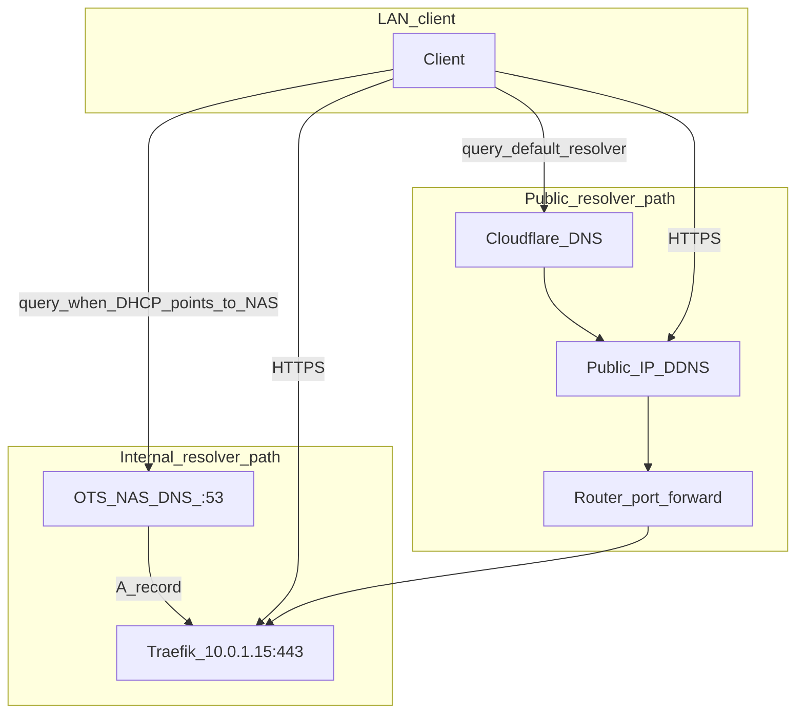

# Synology DNS Server — Split-horizon DNS (internal forward zones)

## Terminology (read this first)

- **Split-horizon DNS** means *different DNS answers for the same hostname* depending on which resolver the client uses (e.g. LAN resolver → LAN IP; public resolver → public IP). That is what this guide implements.
- **Internal forward zones** (Synology DSM **Primary zone** → **Forward zone**) are **authoritative forward DNS** for a zone the NAS owns on the LAN. They are **not** BIND **Views** (Views are per-client-subnet views of zones inside `named`).
- **dnsmasq overrides:** optional `address=/zone/IP` lines under `/etc/dnsmasq.d/` are **static overrides**, not Views. They only apply if Synology’s DNS Server build still consults that dnsmasq layer on your DSM version—**prefer the DSM UI** unless validated.

---

## 0. Hairpin NAT preflight (do this before changing anything)

Many routers (including ASUS) implement **NAT hairpin** / **NAT loopback**: a LAN client resolves a hostname to the **WAN** address, the router notices the target is on the LAN, and forwards traffic internally. If that works, **split-horizon DNS is optional**—it saves a hop and avoids some failure modes but adds moving parts.

From a normal LAN client (not only the NAS), run:

```bash
nslookup otsdrv.otsorundscore.olutechsys.com
# Use -k if your chain still serves a public cert while hitting LAN IP, or after trust store updates:
curl -kI --max-time 15 https://otsdrv.otsorundscore.olutechsys.com
# To inspect the cert without ignoring errors, omit -k once hairpin + trust are correct:
# curl -I --max-time 15 https://otsdrv.otsorundscore.olutechsys.com
```

Automated summary: `bash scripts/verify-dns-views.sh --hairpin [hostname]` (default hostname if omitted: `otsdrv.otsorundscore.olutechsys.com`).

| Outcome | Suggestion |
|-----------|------------|
| `curl` returns HTTP **2xx/3xx** and `nslookup` shows your **public** IP | Hairpin is fine; split-horizon is **optional** (complexity vs benefit). |
| `nslookup` is correct but `curl` **times out** or TLS fails | Hairpin likely broken or blocked; **split-horizon** (internal A records to Traefik LAN IP) is worth doing. |
| You want **internal-only names** or **different answers per VLAN** | Use **internal DNS** (forward zones or a dedicated resolver), not only the router. |

Only after this, change DHCP DNS or add zones.

---

## Overview

**Goal:** On your LAN, resolve names like `otsdrv.otsorundscore.olutechsys.com` to **Traefik’s LAN IP** (e.g. `10.0.1.15`) so clients talk to Traefik **without** relying on public DNS + hairpin.

**What split-horizon does *not* do:** It does **not** “avoid double TLS termination.” **Traefik remains the TLS terminator** on `:443`. Internal A records only change **which IP** the client opens; the client still does TLS to Traefik once.

**What it *does* improve:** Skips the **public / DDNS resolution path** for internal clients, improves **predictability**, and fixes setups where **hairpin NAT does not work**.

**Problem solved (when hairpin fails):**

```
Before: nslookup otsdrv.otsorundscore.olutechsys.com → 73.212.176.x (public IP)
        curl https://otsdrv.otsorundscore.olutechsys.com → TIMEOUT (hairpin NAT failure)

After:  nslookup otsdrv.otsorundscore.olutechsys.com → 10.0.1.15 (Traefik LAN IP)
        curl https://otsdrv.otsorundscore.olutechsys.com → 200/301 (TLS to Traefik on LAN)
```

---

## Prerequisites

- **Synology DNS Server** package installed on OTS NAS (Package Center).
- **OTS NAS (Traefik) IP:** `10.0.1.15` (adjust if yours differs).
- **Misfits NAS IP (optional second zone):** `10.0.1.24`.
- **Cloudflare** (or other) still authoritative on the **public** internet for `olutechsys.com` unless you intentionally delegate subzones publicly (typical homelab: **no** public delegation for these internal names—only your **internal** resolver serves the internal A records).

---

## Step 1: Enable Synology DNS Server

1. SSH into OTS NAS, e.g. `ssh admin@10.0.1.15 -p 28`.
2. Confirm the package is running (commands vary by DSM major):

   ```bash
   # DSM 7 (common): package service
   sudo synopkg status DNSServer 2>/dev/null || true

   # Older DSM: dnsmasq via synoservice
   sudo synoservice --status dnsmasq 2>/dev/null || true

   # systemd-style (some builds)
   sudo synosystemctl status pkgctl-DNSServer 2>/dev/null || true
   ```

3. If not installed: **Package Center** → **DNS Server** → **Install**, then open **DSM → DNS Server** and enable **resolution** per Synology’s wizard.

---

## Step 2: Configure internal zones (pick **one** path)

### Option A — DSM UI (recommended)

1. **DSM** → **DNS Server** → **Zone** → **Create** → **Primary zone**.
2. **Domain type:** **Forward zone**.
3. **Domain name:** `otsorundscore.olutechsys.com`.
4. **Primary DNS server** (SOA MNAME field in Synology UI): use a stable identifier—many homelabs use the **NAS LAN IP** (`10.0.1.15`) or an FQDN under the zone. This zone is for **internal** clients; it is **not** a public delegation from the parent zone unless you explicitly create NS glue at the registrar/Cloudflare.
5. Create **Resource record** → **A**: name `*` (wildcard), IP `10.0.1.15`, TTL `300` (or your preference).
6. Repeat for Misfits if needed: zone `misfitsds.olutechsys.com`, wildcard **A** → `10.0.1.24`.
7. **Apply** / ensure the zone is **enabled**.

**Reverse zones / Active Directory:** Not required for this use case (Traefik hostnames, forward A/AAAA only). Reverse (PTR) is optional mail/reputation tooling.

### Option B — dnsmasq drop-in (advanced)

Only if you confirmed `dnsmasq` is the backend for DNS Server on **your** DSM version and that files under `/etc/dnsmasq.d/` are honored.

```bash
set -euo pipefail
sudo mkdir -p /etc/dnsmasq.d
sudo tee /etc/dnsmasq.d/split-horizon.conf > /dev/null <<'EOF'
# OTS — wildcard to Traefik host
address=/otsorundscore.olutechsys.com/10.0.1.15
address=/.otsorundscore.olutechsys.com/10.0.1.15
# MFT
address=/misfitsds.olutechsys.com/10.0.1.24
address=/.misfitsds.olutechsys.com/10.0.1.24
EOF
```

Restart the DNS Server package (try in order until one succeeds):

```bash
sudo synopkg restart DNSServer \
  || sudo synosystemctl restart pkgctl-DNSServer \
  || sudo synoservice --restart dnsmasq
```

Use [`scripts/setup-dns-views.sh`](../../scripts/setup-dns-views.sh) as a helper—see script header for DSM compatibility notes.

---

## Step 3: Router DHCP (only after you want LAN clients on this resolver)

### DNS SPOF (single point of failure)

If DHCP lists **only** the NAS (`10.0.1.15`) as **DNS Server 1** and leaves **DNS Server 2** empty, **any NAS outage stops DNS for every client** (new lookups fail; cached TTLs may mask it briefly). **Always set DNS Server 2** to a fallback resolver (ASUS LAN gateway `192.168.x.1`, `1.1.1.1`, Pi-hole on another host, etc.). Split-horizon answers for `*.ots.*` / `*.mft.*` only apply when clients actually query the NAS—fallbacks won’t serve those internal zones unless you also forward those zones there.

Prefer **DNS Server 1** = NAS (for internal zones), **DNS Server 2** = router or upstream (general internet + safety net).

ASUS: **Advanced Settings** → **LAN** → **DHCP Server** → set **DNS Server 1** = `10.0.1.15`, optional **DNS Server 2** = `192.168.x.1` or `1.1.1.1`.

Renew leases on clients after changing DHCP.

---

## Step 4: Verify from a LAN client

```bash
nslookup otsdrv.otsorundscore.olutechsys.com
curl -kI --max-time 15 https://otsdrv.otsorundscore.olutechsys.com
```

Automated checks: `bash scripts/verify-dns-views.sh`  
Hairpin vs split comparison: `bash scripts/verify-dns-views.sh --hairpin` or `bash scripts/verify-dns-views.sh --hairpin mftdrv.misfitsds.olutechsys.com`

---

## Step 5: External resolution (optional)

From **outside** your LAN, public resolvers should still return your **public** path (e.g. Cloudflare → DDNS). Internal zones on the NAS do **not** replace public DNS unless you delegate publicly.

---

## Split-DNS flow (Mermaid)



---

## ASCII reference (same idea)

```
LAN client (DHCP → NAS 10.0.1.15 as DNS)
  → UDP/53 query otsdrv.otsorundscore.olutechsys.com
  → Synology authoritative zone otsorundscore.olutechsys.com → A 10.0.1.15
  → TCP/443 TLS to Traefik on 10.0.1.15

LAN client (default resolver, hairpin OK)
  → public IP from Cloudflare
  → router hairpins to Traefik

Internet client
  → Cloudflare → public IP → port forward → Traefik
```

---

## Troubleshooting

- **NXDOMAIN / wrong answer:** Confirm zones in DSM, or `sudo cat /etc/dnsmasq.d/split-horizon.conf` if using Option B; restart **DNSServer** package.
- **Clients not using NAS DNS:** Router DHCP and lease renewal; on macOS `scutil --dns`.
- **DNS works but curl fails:** Traefik down, wrong Host/SNI, or firewall—test `curl -kI https://10.0.1.15 -H "Host: otsdrv.otsorundscore.olutechsys.com"`.

---

## Secondary resolver (mitigates DNS SPOF)

If the NAS running DNS Server is offline, clients need a **second resolver** that still answers generic internet queries. That resolver will **not** know your internal forward zones unless you replicate them—hence the split between “split-horizon convenience” vs “always-up public DNS path.” See **DNS SPOF** above.

---

## ACME: acme-sh, Traefik, and internal DNS (Cloudflare DNS-01)

**acme.sh (AcmeSh stack)** and **Traefik’s optional `certificatesResolvers.cloudflare` resolver** both use **Cloudflare’s API** for **DNS-01**. Neither consults your **internal** Synology forward zones or dnsmasq overrides. **No public delegation** of internal-only zones is required for issuance, and **split-horizon DNS is not part of the ACME trust path**.

- **Wildcards** such as `*.otsorundscore.olutechsys.com` and `*.misfitsds.olutechsys.com` are issued against **public** Cloudflare DNS (same account/token scope as always). Internal LAN DNS only affects **where clients connect after** they have a cert name—**not** whether Let’s Encrypt can validate `_acme-challenge` TXT records.

- **Operational note:** this repo’s default Traefik TLS surface still uses **PEM files** produced by **acme-sh** under `${ACME_CERT_ROOT}` (see `stacks/traefik-*/config/tls.yaml`). Traefik’s built-in resolver is **additional** infrastructure for routers that opt into `tls.certresolver=cloudflare`; it does **not** replace acme-sh unless you migrate routers explicitly.

---

## Key points

| Topic | Fact |
|--------|------|
| TLS | **Traefik still terminates TLS** on internal access; split DNS only steers you to the right IP. |
| Hairpin | Test **before** investing in split-horizon; many routers already work. |
| ACME (acme-sh / Traefik Cloudflare resolver) | **Unaffected** by internal split-horizon — DNS-01 uses Cloudflare API only. |
| Public DNS | **Unchanged** unless you deliberately delegate subzones to the NAS at the registrar. |
| BIND “views” | This setup uses **forward zones** (DSM) or **dnsmasq address=** (CLI)—not BIND views. |

---

## Next steps

1. Run **hairpin preflight** (section 0).
2. If needed: create **forward zones** in DSM (Option A).
3. Point DHCP DNS at the NAS **with a fallback**.
4. Run **`scripts/verify-dns-views.sh`** (and **`--hairpin [hostname]`** once from a LAN client).

### After TLS / ACME changes (operator checklist)

On the NAS: `docker compose restart traefik-ots traefik-mft` (or your Dockge equivalent) so Traefik reloads certs. **Do not delete** `acme.json` / acme-sh state unless you are following `stacks/acme-sh/SETUP.md` rotation. From a LAN client: `curl -kI --max-time 15 https://<real-hostname>` and `echo | openssl s_client -servername <hostname> -connect <ip>:443 2>/dev/null | openssl x509 -noout -subject -dates` to confirm SAN and expiry.

Further stack examples (Pi-hole, Technitium) live in git history of this doc if you reintroduce them; prefer Dockge stack paths under `/volume1/docker/dockge/stacks/` when adding containers.
